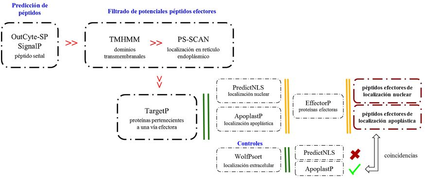

# Laccaria_MiSSPs_proyect
This is 'MiSSPs tesis' repository under construction

###### Elena Flores Callejas  March 2021

#### Aim: Predict the potential MiSSPs for *Laccaria trichodermophora*, as well as if they are specific proteins or if they belong to the core regulon of the genus.

#### Work flow

1. Install and test the required programs
##### 1.1 Programs: 
##### BLAST 2.11.0+ (Altschul et al. 1990), SignalP v 5.0 (Almagro et al. 2019), EffectorP v2.0 (Sperschneider et al. 2015), ApoplastP v2.0 ( Sperschneider et al. 2018), OutCyte-SP (Zhao et al. 2019), WolfPsort (Horton et al. 2007; https://www.genscript.com/wolf-psort.html), TMHMM v2.0 (; Melén et al. 2003; http://www.cbs.dtu.dk/services/TMHMM/), Target P v1.1 (Emanuelsson et al. 2000), PS-SCAN v1.79, HMMER (Cheng 2014), PredictNLS v1.0.20 (https://rostlab.org/owiki/index.php/PredictNLS), OrthoFinder v2.5.2 (Emms 2020) 
2. Download fasta files of *Laccaria* proteomes available on public databases (NCBI https://www.ncbi.nlm.nih.gov, JGI Mycocosm https://mycocosm.jgi.doe.gov/mycocosm/home) and those obtained in the laboratory; as well as *Laccaria* MiSSPs available protein sequences in public databases (NCBI https://www.ncbi.nlm.nih.gov)
3. Search for MiSSPs of *Laccaria bicolor* in genomes and proteomes of species of the genus
4. Predict nuclear localized and apoplastic secreted effector proteins using the following pipeline

5. Homology detection

#### Directory structure

###### path /home/Laccaria_MiSSP/ TREE

`Laccaria_MiSSP` Project directory

`README.txt` Project description text file

`bin` Tested and functional executional and data mining scripts (`.sh`), as well as variables lists  

`data` Data files of genomes (`.fna`), proteomes (`.faa`) and MiSSPs (`.faa`)

`meta` Metadata files 

`old` Old versions, results and scripts (old stuff)

`out` Output files

`res` Obtained and summarized results

